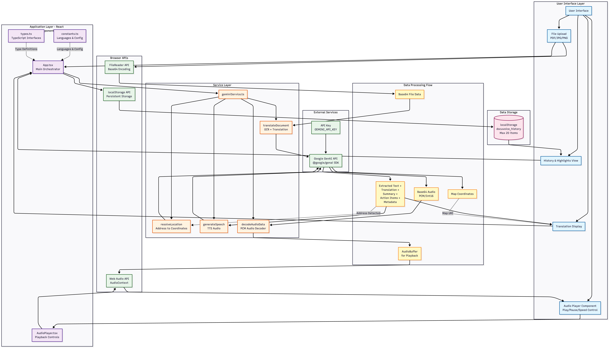

# DocuVoice Interpreter

An accessible document reader that extracts text from PDFs or images, translates it to a chosen language, and reads the translation aloud using Text-to-Speech. Designed for low-literacy accessibility and quick comprehension of official documents (bills, forms, government orders).

## Architecture Diagram of the project




## Highlights

- Upload PDF / image (JPG, PNG) and extract visible text
- Translate text into many target languages (Indian languages prioritized)
- Generate a simplified summary and a list of action items
- Generate speech (TTS) and play it back with adjustable speed
- Save a short local history (stored in browser localStorage)
- Basic detection/extraction of official document metadata (GO number, department, date, subject)
- Resolve physical addresses to map coordinates when possible

## Demo / Quick Start

If you'd like, I can:
- update `geminiService.ts` to read `import.meta.env.VITE_API_KEY` for local Vite dev, and add a sample `.env.example` file, or
- add a tiny server proxy to keep the API key off the client.

<div align="center">

</div>

# Run and deploy your AI Studio app

This contains everything you need to run your app locally.

View your app in AI Studio: https://ai.studio/apps/drive/1aKoTrS1N0Gfo19tLi2VR-yw4Vg60Rd50


## Lcoal setup 
Prerequisites: Node 18+ recommended, npm installed.

1. Install dependencies

```bash
npm install
```

2. Provide an API key for the Google GenAI SDK (used for text extraction/translation and TTS). See "Environment" below.

3. Run the dev server

```bash
npm run dev
```

Open http://localhost:5173 (Vite default) and upload a PDF or image to try the app.

## What the app does (user flow)

1. User uploads a document (PDF, JPG, PNG). Images are optionally compressed client-side for faster upload and lower size.
2. The app sends the base64 file to the translation/extraction service which:
   - Extracts visible text
   - Translates it into the chosen language (returns Markdown-formatted text)
   - Produces a simplified summary and action-items
   - Detects if the document is an official/government document and returns relevant metadata
   - Detects an address string (if present)
3. If an address is found, the app optionally queries for coordinates and a map URI.
4. The app requests a TTS audio from the model and decodes the returned base64 audio for playback.
5. The user can play/pause, change playback speed, download the translated text, and save highlights.

## Files of interest

- `App.tsx` - Main UI, file upload, orchestration of translation/audio generation, history and highlights
- `components/AudioPlayer.tsx` - Small audio playback component with play/pause, restart and speed controls
- `services/geminiService.ts` - Encapsulates calls to the Google GenAI library for:
  - document translation/extraction (`translateDocument`)
  - location resolution (`resolveLocation`)
  - TTS generation (`generateSpeech`)
  - raw audio decoding helper (`decodeAudioData`)
- `constants.ts` - Supported languages, UI translations, playback speed options
- `types.ts` - TypeScript types and interfaces used across the app
- `index.html`, `index.tsx`, `vite.config.ts` - Vite + React app bootstrap
- `metadata.json` - App metadata (name, description)

## Supported file types & limits

- Supported upload types: PDF, JPG, PNG
- Max client-side file size: ~10 MB (the UI enforces a 10MB limit). Images get compressed to improve reliability.

## Environment / API key

This app uses the `@google/genai` package to call Google GenAI models for OCR/translation and TTS. You must provide an API key for the Google GenAI SDK.

- The code currently reads the key from `process.env.API_KEY` in `services/geminiService.ts` when building the `GoogleGenAI` client. For local development with Vite you can:
  - Create a `.env` file at the project root and add your key. If you use Vite, use `VITE_` prefixed variables (e.g. `VITE_API_KEY=...`) and update `geminiService.ts` to use `import.meta.env.VITE_API_KEY` instead of `process.env.API_KEY` (recommended) — or configure Vite to expose `process.env.API_KEY` via `define` in `vite.config.ts`.

Be careful: embedding API keys in client-side code exposes them to end users. For production, run the GenAI calls from a secure server (server-side) or a proxy that stores the key securely.

## Development notes

- Framework: React + TypeScript
- Bundler: Vite
- UI: Tailwind is included via CDN in `index.html` for quick styling
- The app stores translation history and highlights in `localStorage` under `docuvoice_history` (keeps up to the 20 most recent items).
- Audio decoding: `decodeAudioData` in `services/geminiService.ts` decodes raw PCM/Int16 audio returned by the model into an `AudioBuffer` for playback.

## Known behaviors & edge-cases

- Browsers require a user gesture to start audio (AudioContext may be suspended until user interacts). The app attempts to resume the audio context when playing.
- The client currently sends base64 file data directly to the GenAI SDK. For large-scale or production usage, send the file to a server-side component that calls the GenAI API to avoid exposing keys and to handle rate-limiting/retries.
- The `geminiService` code assumes the GenAI responses follow a JSON schema; model changes may require updates to parsing logic and responseSchema.

## How to build & deploy

Build for production with Vite:

```bash
npm run build
```

Preview a production build locally:

```bash
npm run preview
```

For deployment, serve the `dist` output using any static host (Netlify, Vercel, static S3+CloudFront, etc.). If you keep using the GenAI client from the browser, ensure environment variable handling exposes the API key at build time or move GenAI calls server-side.

## Adding or updating languages

Supported languages are defined in `constants.ts` (`SUPPORTED_LANGUAGES`). Add a new entry there (code, name, nativeName) and add any UI translations to `UI_TRANSLATIONS` if needed.

## Testing ideas / next steps

- Add a small Node/Express server to proxy GenAI calls and keep the API key server-side
- Add unit tests for `services/geminiService` parsing logic (mock GenAI responses)
- Improve robust audio playback with accurate seek/position tracking and scrubbing
- Add server-side OCR fallback for PDFs that do not return text reliably

## Contributing

Contributions are welcome. Please open issues or PRs describing features or fixes.

---
